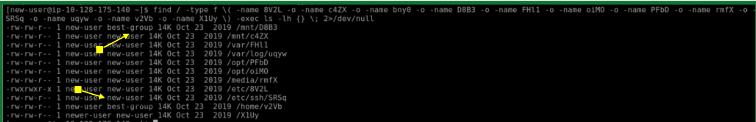
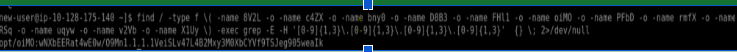

# TryHackMe: Ninja Skills Write-up

* **Room Link:** [TryHackMe - Ninja Skills](https://tryhackme.com/room/ninjaskills)
* **Category:** Linux / Tooling
* **Difficulty:** Easy/Medium

## Objective
The goal of this room was to locate specific files scattered across a Linux filesystem and extract critical metadata, including SHA1 hashes, IP addresses, and specific User IDs (UIDs).

## Challenges & Solutions

### Task 1: Efficiently Locating Files
Initially, syntax errors occurred due to spacing constraints around parentheses in the `find` command. 

**Mistake:**
\`\`\`bash
find / -type f \ (-name 8V2L ... \)
\`\`\`

**Correction:**
The `find` utility requires strict spacing so the shell passes the escaped characters accurately:
\`\`\`bash
find / -type f \( -name 8V2L -o -name c4ZX \) 2>/dev/null
\`\`\`

### Task 2: Finding Content inside Files
To locate an IP address hidden across multiple files, I combined `find` with an extended regular expression via `grep`:
\`\`\`bash
-exec grep -E -H '[0-9]{1,3}\.[0-9]{1,3}\.[0-9]{1,3}\.[0-9]{1,3}' {} \;
\`\`\`

## Key Takeaways
* Mastered regex patterns for tracking target data (like IPv4 addresses).
* Learned how to switch flags (`ls -lh` vs `ls -ln`) to expose raw numeric UIDs (like UID 502).